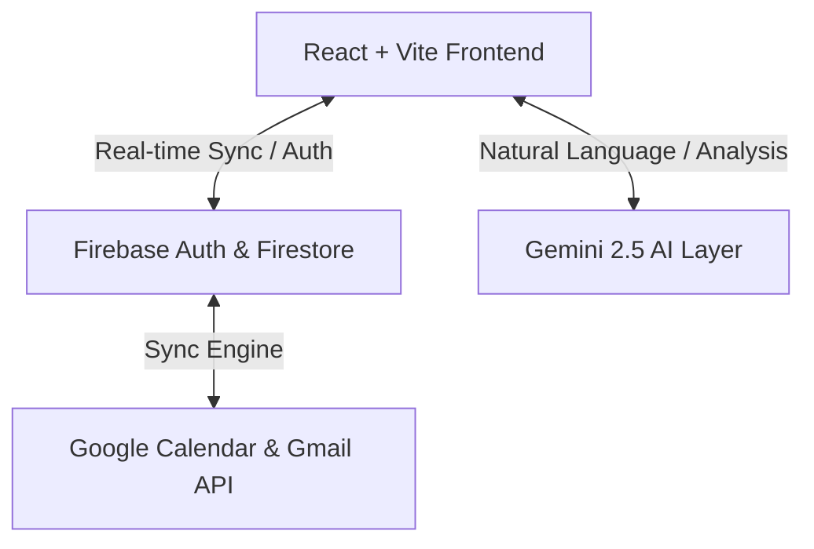

# Momentum AI - System & Architecture Design

This document details the system design, architecture, database schema, and component layout for **Momentum AI**, an AI-powered productivity companion designed to prevent missed deadlines.

---

## 1. System Architecture

Momentum AI is designed as a client-server web application with a decoupled AI processing layer.



- **Frontend Client**: Built with React, TypeScript, Vite, and Tailwind CSS. The app features state-driven routing, modern component patterns, and real-time client-side synchronization.
- **Backend & Auth Services**: Powered by Firebase. Firebase Authentication handles session management, while Firestore provides a real-time, document-oriented NoSQL database.
- **AI Processing Layer**: Connects directly to the Gemini 2.5 API (or via a serverless function) to analyze task deadlines, forecast stress, suggest schedule blocks, and power the AI Coach.
- **External Integrations**: Synchronizes tasks and events with the Google Calendar API and Google Calendar sync engine.

---

## 2. Database Schema (Firestore)

Firestore stores user profiles, tasks, events, focus sessions, and AI telemetry in a collection-document structure.

### `users` (Collection)
- **ID**: `uid` (matching Firebase Auth User ID)
- **Fields**:
  - `displayName`: `string`
  - `email`: `string`
  - `photoURL`: `string`
  - `createdAt`: `timestamp`
  - `preferences`: `map`
    - `workingHoursStart`: `string` (e.g., `"09:00"`)
    - `workingHoursEnd`: `string` (e.g., `"18:00"`)
    - `sleepScheduleStart`: `string` (e.g., `"23:00"`)
    - `sleepScheduleEnd`: `string` (e.g., `"07:00"`)
  - `momentumScore`: `number` (0-100)

### `tasks` (Collection)
- **ID**: `taskId` (auto-generated)
- **Fields**:
  - `userId`: `string` (Index reference to `users`)
  - `title`: `string`
  - `description`: `string`
  - `category`: `string` (e.g., `"Academic"`, `"Personal"`, `"Professional"`)
  - `priority`: `string` (`"critical"`, `"high"`, `"medium"`, `"low"`)
  - `deadline`: `timestamp`
  - `estimatedDuration`: `number` (in minutes)
  - `status`: `string` (`"pending"`, `"in_progress"`, `"completed"`, `"missed"`)
  - `completedAt`: `timestamp` (nullable)
  - `createdAt`: `timestamp`
  - `riskScore`: `number` (predicted probability of missing deadline, computed by AI)

### `events` (Collection)
- **ID**: `eventId` (auto-generated)
- **Fields**:
  - `userId`: `string` (Index reference to `users`)
  - `title`: `string`
  - `startTime`: `timestamp`
  - `endTime`: `timestamp`
  - `location`: `string`
  - `notes`: `string`
  - `eventType`: `string` (e.g., `"Meeting"`, `"Interview"`, `"Hackathon"`)
  - `googleCalendarEventId`: `string` (nullable, for bi-directional sync)

### `focus_sessions` (Collection)
- **ID**: `sessionId` (auto-generated)
- **Fields**:
  - `userId`: `string`
  - `durationMinutes`: `number`
  - `startTime`: `timestamp`
  - `endTime`: `timestamp`
  - `associatedTaskId`: `string` (nullable)

---

## 3. Frontend Component Structure

The dashboard interface uses a fixed 3-column layout on desktop:
1. **Left Sidebar Navigation** (260px width, fixed)
2. **Main Content Area** (Flexible, dominant width)
3. **Right Insight Panel** (360px width, contextual helper)

```
+------------------------------------------------------------------------------------+
| LEFT SIDEBAR (260px)  | MAIN CONTENT AREA                               | RIGHT    |
| - Logo & Glow         | +---------------------------------------------+ | INSIGHTS |
| - Nav Menu Items      | | Top Header: Greeting, User Avatar & Profile | | (360px)  |
| - Profile Info        | +---------------------------------------------+ | - AI Rec |
| - Settings            | | WEEK CALENDAR VIEW (70% width)              | | - Tasks  |
| - Momentum Score Widget| | - Day/Week/Month selector                   | | - Actions|
|                       | | - Grid with time-blocks & dragging          | |          |
|                       | +---------------------------------------------+ |          |
|                       | | BOTTOM STATS SUMMARY (4 Grid Cards)         | |          |
+------------------------------------------------------------------------------------+
```

---

## 4. Design Style & Palette

The design aesthetic mirrors the reference SaaS workspace dashboard with clean spacing, Outfit and Inter typography, 18px rounded card edges, and pastel accent details.

### A. Light Mode (Default Theme)
- **Background**: `#F8FAFC` (Soft light grey-blue canvas background)
- **Sidebar Background**: `#FFFFFF` (Pure white navigation side panel)
- **Card Background**: `#FFFFFF` (Pure white card surfaces)
- **Calendar Surface**: `#FFFFFF` (Clean workspace table layout)
- **Primary Accent**: `#6D5DF6` (Sleek lavender purple)
- **Secondary Accent**: `#8B7CF8` (Soft purple details)
- **Text Primary**: `#111827` (Matte black/grey headline text)
- **Text Secondary**: `#64748B` (Muted caption text)
- **Border**: `#E5E7EB` (Clean white-grey borders)
- **Priority Colors**:
  - Critical / Danger: `#EF4444` (Electric Red)
  - Warning / High: `#F59E0B` (Electric Orange)
  - Medium / Success: `#22C55E` (Electric Green)
  - Low / Information: `#06D6FF` (Electric Cyan)

### B. Dark Mode Theme
- **Background**: `#0B0B0F` (Near-black workspace canvas)
- **Sidebar Background**: `#111318` (Matte dark grey panel background)
- **Card Background**: `#161B22` (Clean dark card surface)
- **Calendar/Surface**: `#1C2230` (Clean dark calendar surface overlay)
- **Primary Accent**: `#6D5DF6` (Lavender purple)
- **Secondary Accent**: `#8B7CF8` (Soft purple accent highlights)
- **Text Primary**: `#F8FAFC` (Near-white title text)
- **Text Secondary / Muted**: `#94A3B8` (Muted captions)
- **Border**: `rgba(255,255,255,0.08)` (Thin grey borders)

- **Typography**: Inter (Body copy, high readability) and Outfit (Headers, sleek technical geometry).
- **Transitions**: Clean, smooth transition timings for hover indicators and theme switches.
